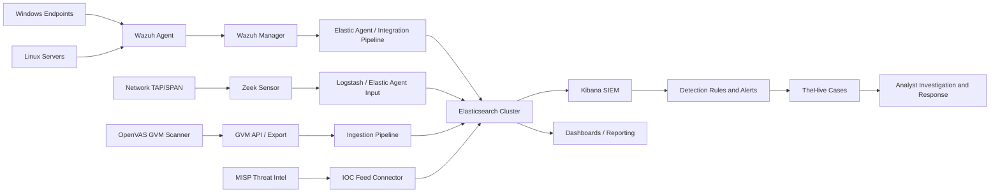

# Capstone Phase 1 Report

## Building a Risk-Driven SOC with Elastic Stack, Wazuh, OpenVAS, and Zeek

Institution: AIU  
Course: Capstone Project  
Phase: Phase 1 - GRC Foundation and SOC Architecture  
Date: March 17, 2026

---

## 1. Executive Summary

AIU is implementing a risk-driven Security Operations Center (SOC) using an open-source-first strategy. The Elastic Stack is the core SIEM and data lake platform, with Wazuh for endpoint detection, OpenVAS/GVM for vulnerability management, Zeek for network security monitoring, MISP for threat intelligence, and TheHive for case management.

This report provides:
- Top 5 business risks and mapped NIST CSF controls.
- SOC tooling architecture and data flow design.
- Prioritized log source onboarding plan aligned to risk reduction goals.
- Stand-alone deployment evidence scope for Elastic Stack, Wazuh, OpenVAS, and Zeek.

---

## 2. Risk Register and NIST CSF Control Mapping

### 2.1 Method

Risks were selected based on confidentiality, integrity, and availability impact to core university services:
- Student Information Systems
- Learning Management Systems
- Faculty/Admin credentials
- Internal APIs and web applications
- Endpoint and server fleet

Risk rating logic:
- Likelihood: 1 (Low) to 5 (Very High)
- Impact: 1 (Low) to 5 (Very High)
- Risk Score: Likelihood x Impact

### 2.2 Risk Register and Control Mapping Table

| Risk ID | Business Risk | Likelihood | Impact | Risk Score | NIST CSF Controls | Control Description | Primary Data Sources |
|---|---|---:|---:|---:|---|---|---|
| R1 | Credential Theft leading to Data Exfiltration | 5 | 5 | 25 | PR.AC-1, PR.AC-7, DE.CM-1, DE.CM-3, RS.AN-1 | Identity governance, MFA, network and user activity monitoring, and incident analysis | Windows Security Events, Linux Auth logs, Wazuh alerts, Zeek conn logs |
| R2 | Ransomware on critical servers/endpoints | 4 | 5 | 20 | PR.IP-1, PR.IP-12, DE.CM-4, DE.AE-2, RS.MI-1 | Baseline hardening, vulnerability management, malicious code detection, anomaly analysis, containment | Wazuh alerts, OpenVAS scan results, Windows Sysmon/Security, Linux logs |
| R3 | Web Application Breach (SQLi/XSS/RCE) | 4 | 5 | 20 | PR.AC-3, PR.DS-6, DE.CM-7, DE.AE-1, RS.CO-2 | Least privilege, integrity checks, external perimeter monitoring, anomaly baselines, coordinated response | WAF/web logs (future), Zeek conn/http logs, OpenVAS findings, Wazuh alerts |
| R4 | Lateral Movement after initial compromise | 4 | 4 | 16 | PR.AC-5, DE.CM-1, DE.CM-4, DE.AE-3, RS.RP-1 | Network segmentation, east-west monitoring, malicious activity detection, event correlation, response playbooks | Zeek conn logs, Windows event logs, Linux auth logs, Wazuh alerts |
| R5 | Exploitation of unpatched vulnerabilities | 5 | 4 | 20 | ID.RA-1, ID.RA-5, PR.IP-12, DE.CM-8, RS.MI-3 | Asset and vulnerability identification, patch management, vulnerability scan telemetry, mitigation tracking | OpenVAS scan results, CMDB/asset inventory (future), Wazuh vulnerability data |

---

## 3. SOC Tooling Architecture and Data Flow

### 3.1 Architecture Principles

- Elastic Stack is the single analytics and data lake backbone.
- Endpoint, network, and vulnerability telemetry converge in Elasticsearch.
- Kibana provides centralized detection, dashboards, and analyst workflows.
- TheHive receives high-confidence alerts as cases.
- MISP enriches detections with IOC intelligence.

### 3.2 SOC Architecture Diagram

### 3.3 Logical Data Flows

1. Endpoint telemetry:
- Wazuh agents collect endpoint events.
- Wazuh manager normalizes and forwards relevant security data.
- Data is ingested into Elasticsearch for correlation and alerting.

2. Network telemetry:
- Zeek analyzes mirrored network traffic.
- Zeek logs (conn, dns, http, ssl) are shipped to Logstash/Elastic Agent.
- Enriched records are indexed in Elasticsearch.

3. Vulnerability telemetry:
- OpenVAS executes scans against approved targets.
- Findings are exported via API or transformed pipeline.
- Vulnerability findings are indexed for asset risk context.

4. Threat intelligence and case management:
- MISP IOCs are synchronized into Elastic for matching.
- High-confidence alerts are pushed to TheHive for triage and case workflow.

---

## 4. Data Source Onboarding Plan (Risk-Based Priority)

### 4.1 Required Data Sources

The following required sources are included in the onboarding plan:
- Windows Security Events
- Linux System Auth logs
- Zeek conn logs
- Wazuh alerts
- OpenVAS scan results

### 4.2 Priority Matrix

| Priority | Data Source | Primary Risk Coverage | Why First | Ingestion Path | KPI |
|---|---|---|---|---|---|
| P1 | Wazuh alerts | R1, R2, R4 | Immediate high-fidelity detections for endpoint threats | Wazuh manager -> Elastic integration -> Elasticsearch | Alert latency < 2 min |
| P1 | Windows Security Events | R1, R4 | Detect credential misuse and privilege escalation | Elastic Agent/Wazuh -> Elasticsearch | Log coverage > 90% critical hosts |
| P1 | Linux System Auth logs | R1, R4 | SSH abuse and lateral movement visibility | Elastic Agent/Filebeat -> Elasticsearch | Failed login parsing accuracy > 95% |
| P2 | OpenVAS Scan Results | R2, R5 | Prioritize patching by exposure and CVSS risk | GVM API/export -> ingestion pipeline -> Elasticsearch | Scan-to-index time < 24h |
| P2 | Zeek conn logs | R1, R3, R4 | Network-level anomaly and exfiltration signals | Zeek -> Logstash/Elastic Agent -> Elasticsearch | Network telemetry uptime > 95% |

### 4.3 4-Week Onboarding Timeline

Week 1:
- Integrate Wazuh alerts and endpoint host metadata.
- Start Windows Security Events onboarding for domain controllers and critical servers.

Week 2:
- Add Linux auth logs from production-like server subset.
- Create baseline dashboards for auth failures, brute force, and suspicious commands.

Week 3:
- Integrate OpenVAS results and normalize vulnerability fields (asset, CVE, CVSS, severity).
- Build vulnerability-to-asset risk dashboards.

Week 4:
- Enable Zeek conn log ingestion from SOC-monitored segment.
- Add network anomaly detections and correlation rules with endpoint telemetry.

### 4.4 Acceptance Criteria

- Required five data sources ingested and searchable in Kibana.
- At least one detection rule per top risk is active.
- Initial dashboards available for SOC triage and weekly reporting.
- Alerting workflow to TheHive documented and test event validated.

---

## 5. Stand-Alone Working Edition Evidence (What Must Be Included)

For the Phase 1 submission package, include evidence for each required platform:

1. Elastic Stack:
- `bash status.sh` or `docker ps` showing Elasticsearch, Kibana, Fleet, and Logstash containers.
- Kibana screenshot with indexed security data.
- Cluster health API output (`_cluster/health`).

2. Wazuh:
- `docker-compose ps` in `wazuh/single-node`.
- Wazuh dashboard screenshot with alerts/events.
- API authentication proof and sample response.

3. OpenVAS/GVM:
- `gvm/status-gvm.sh` output or `docker compose ps` for GVM stack.
- GSA screenshot showing scan configs, tasks, or scan results.
- Sample scan result screenshot or export metadata.

4. Zeek:
- `zeek/status-zeek.sh` output.
- `zeek/logs/current/conn.log` sample records.
- `zeek/evidence/elasticsearch-proof.json` showing hits in `zeek-*`.

---

## 6. Implementation Status Snapshot (Current Repo)

Based on current project artifacts and validated evidence files:
- Elastic Stack: Implemented and accessible through Kibana and Elasticsearch APIs.
- Wazuh: Implemented with dashboard and API authentication working.
- OpenVAS/GVM: Implemented with dashboard access and scan workflow available.
- Zeek: Implemented with verified `conn.log` output and Elasticsearch ingestion proof saved under `zeek/evidence/`.

---

## 7. Conclusion

AIU Phase 1 establishes a risk-driven SOC design with clear GRC mapping, architecture, and data onboarding priorities. The design aligns monitoring capabilities to business risk reduction and creates a practical foundation for operational SOC execution in later phases.

---

## Appendix A: NIST CSF Control Reference Used

- ID.RA-1: Asset vulnerabilities are identified and documented.
- ID.RA-5: Threats, vulnerabilities, likelihoods, and impacts are used to determine risk.
- PR.AC-1: Identities and credentials are managed.
- PR.AC-3: Remote access is managed.
- PR.AC-5: Network integrity is protected.
- PR.AC-7: Users, devices, and other assets are authenticated.
- PR.DS-6: Integrity checking mechanisms are used.
- PR.IP-1: Baseline configurations are created and maintained.
- PR.IP-12: Vulnerability management plan is developed and implemented.
- DE.AE-1: Baseline network operations and expected data flows are established.
- DE.AE-2: Detected events are analyzed to understand attack targets/methods.
- DE.AE-3: Event data are aggregated and correlated.
- DE.CM-1: The network is monitored.
- DE.CM-3: Personnel activity is monitored.
- DE.CM-4: Malicious code is detected.
- DE.CM-7: Monitoring for unauthorized personnel/connections/devices/software is performed.
- DE.CM-8: Vulnerability scans are performed.
- RS.AN-1: Notifications from detection systems are investigated.
- RS.CO-2: Incidents are reported consistent with criteria.
- RS.MI-1: Incidents are contained.
- RS.MI-3: Newly identified vulnerabilities are mitigated.
- RS.RP-1: Response plan is executed during/after incident.
